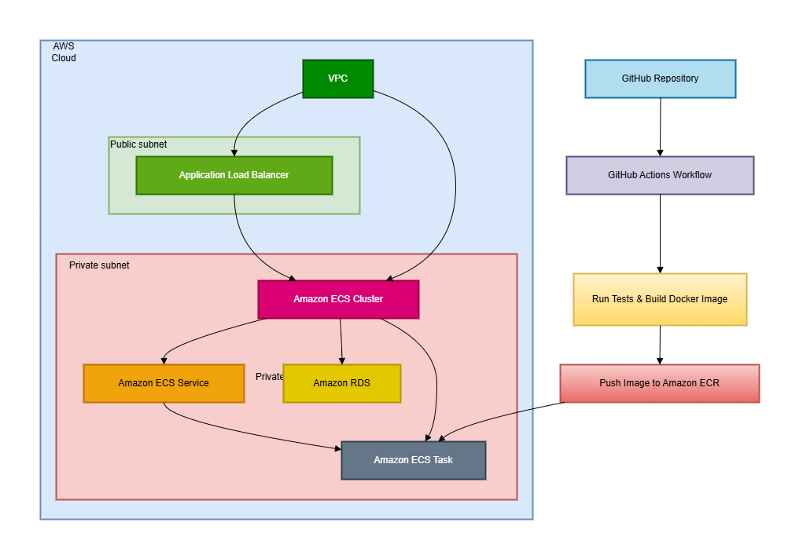

# Terraform Infrastructure for Application Deployment

This Terraform configuration creates an AWS infrastructure for hosting an application with ECS, a PostgreSQL database, EFS storage, load balancers, and service discovery.

## Infrastructure Overview

The infrastructure is composed of the following components:

- **VPC**: A virtual private cloud (VPC) with public and private subnets spread across multiple availability zones.
- **ECS (Elastic Container Service)**: Hosts the application and database using Fargate launch type.
- **PostgreSQL Database**: Managed through ECS with data stored in EFS (Elastic File System).
- **Load Balancer**: An Application Load Balancer (ALB) to route HTTP traffic to the application containers.
- **ECR Repository**: Container images for the app and database are stored in Amazon Elastic Container Registry (ECR).
- **Service Discovery**: Used to enable communication between services (e.g., the application can discover the database using a DNS entry).
- **IAM Roles and Policies**: Defines the permissions required for ECS tasks, logs, and container execution.

### Modules in Use:
- **networking**: Creates VPC, subnets, route tables, security groups, and the internet gateway.
- **ecs**: Creates an ECS cluster and manages task definitions for the application and database.
- **database**: Configures the PostgreSQL database within ECS with EFS volume.
- **backend**: Configures backend services (e.g., the application) in ECS with load balancer and service discovery.
  
## Requirements

- **AWS Account**: You need an AWS account and access keys to deploy the resources.
- **Terraform**: This setup assumes you are using Terraform to provision the infrastructure.

## Environment Variables

You need to set the following environment variables for the configuration:

### Global Environment Variables:
- `project`: The project name. Example: `my-app`
- `environment`: The environment name. Example: `dev`, `prod`, etc.
- `vpc_cidr`: The CIDR block for the VPC. Example: `10.0.0.0/16`
- `public_subnet_cidrs`: List of CIDR blocks for public subnets. Example: `["10.0.1.0/24", "10.0.2.0/24"]`
- `private_subnet_cidrs`: List of CIDR blocks for private subnets. Example: `["10.0.3.0/24", "10.0.4.0/24"]`
- `availability_zones`: List of availability zones. Example: `["us-west-2a", "us-west-2b"]`
- `aws_region`: The AWS region for deployment. Example: `us-west-2`
- `db_name`: The name of the PostgreSQL database. Example: `mydb`
- `db_user`: The database username. Example: `admin`
- `db_password`: The database password. Example: `password123`
  
### ECS Environment Variables:
- `ecs_execution_role_arn`: ARN of the ECS execution role.
- `ecs_task_role_arn`: ARN of the ECS task role.
- `ecs_cluster_id`: ECS cluster ID for the application and database services.
- `ecs_execution_role_name`: The ECS execution role name.
- `ecs_task_role_name`: The ECS task role name.
- `service_discovery_namespace_id`: The service discovery namespace ID for service registration.

### Security Groups:
- `alb_security_group_id`: The security group for the Application Load Balancer (ALB).
- `app_security_group_id`: The security group for the application.
- `db_security_group_id`: The security group for the database.

## Usage

1. **Initialize Terraform**:
   ```bash
   terraform init

2. **Review the Plan: To see the changes that will be applied**:
    ```bash
    terraform plan
3. **Apply the Configuration: To apply the infrastructure changes**:
    ```bash
    terraform apply
4. **Destroy the Infrastructure: When you are done, you can destroy the infrastructure with**:
    ```bash
    terraform destroy

# Tracking Analytics Deployment

This repository contains the deployment automation for the **Tracking Analytics Application** using GitHub Actions, Docker, and Terraform to deploy infrastructure to AWS. It supports **two environments**: `Dev` and `Prod`.

## Workflow Overview

The `Tracking-Analytics-Deployment` GitHub Actions workflow automates the following tasks:

- **Build and Push Docker Image** to Amazon ECR
- **Deploy Infrastructure** to AWS using Terraform
- **Test Execution** for the application
- **Environment Configuration** based on `Dev` or `Prod`

The deployment is triggered by:
- A **Pull Request to the `dev` branch**.
- **Manual trigger** via GitHub Actions (for both `dev` and `prod` environments).

## Environments

The deployment workflow handles two environments:
1. **Dev**: The development environment is used for testing and development purposes.
2. **Prod**: The production environment for live applications.

### Environment Variables
The workflow uses environment variables to define the configuration for each environment.

- **`DEV`**:
    - AWS credentials for development.
    - Database credentials for the development environment.
    
- **`PROD`**:
    - AWS credentials for production.
    - Database credentials for the production environment.
    - Requires manual confirmation before deploying to production.

## GitHub Secrets

Before running the workflow, ensure that the following GitHub secrets are set at the repository level:

### AWS Credentials
- `TRACKING_DEV_AWS_ACCESS_KEY_ID`: AWS access key ID for the **dev** environment.
- `TRACKING_DEV_AWS_SECRET_KEY`: AWS secret key for the **dev** environment.
- `TRACKING_PROD_AWS_ACCESS_KEY_ID`: AWS access key ID for the **prod** environment.
- `TRACKING_PROD_AWS_SECRET_KEY`: AWS secret key for the **prod** environment.

### Database Credentials
- `DB_NAME_DEV`, `DB_USER_DEV`, `DB_PASSWORD_DEV`: Database credentials for the **dev** environment.
- `DB_NAME_PROD`, `DB_USER_PROD`, `DB_PASSWORD_PROD`: Database credentials for the **prod** environment.

### AWS ECR Repository and Terraform State Configuration
The workflow creates ECR repositories and S3 buckets dynamically, depending on the environment (Dev or Prod). These configurations are handled automatically by the workflow.

## Workflow Steps

1. **Checkout Code**: The code is checked out from the repository to the runner.
   
2. **Setup Python**: Python 3.11 is set up on the runner to install dependencies and run tests.
   
3. **Install Dependencies**: Python dependencies are installed using `pip` based on the `requirements.txt` file. Test dependencies (e.g., `pytest`) are also installed.
   
4. **Run Tests**: The workflow runs unit tests using `pytest` to ensure the application is functioning correctly.
   
5. **Set Environment Variables**: The environment (`Dev` or `Prod`) is determined based on the event that triggered the workflow.
   
6. **Configure AWS Credentials**: AWS credentials are configured dynamically based on the environment, using the secrets stored in GitHub.
   
7. **Login to Amazon ECR**: Logs into Amazon ECR to push Docker images.

8. **Build and Push Docker Image**: A Docker image is built for the application and pushed to the respective ECR repository.

9. **Setup Terraform**: Terraform is initialized to deploy infrastructure using the specified backend configuration (S3 bucket).

10. **Deploy Infrastructure with Terraform**: The Terraform configuration is applied to provision the required resources on AWS. 

    - For **Prod** deployments, a manual approval is required before deployment proceeds.

## Manual Deployment

You can trigger the deployment manually by navigating to the **Actions** tab in the GitHub repository and selecting the workflow. You will need to specify the environment (`dev` or `prod`) when initiating the workflow.

For **prod** deployments, the workflow will ask for manual approval to proceed.

## Terraform Configuration

The workflow uses Terraform to provision infrastructure in AWS. The environment-specific configuration is provided in the following `.tfvars` files:
- `terraform/environments/dev.tfvars`
- `terraform/environments/prod.tfvars`

The Terraform configuration manages:
- AWS resources like EC2, RDS, and ECR.
- The Terraform state is stored in an S3 bucket, with versioning and encryption enabled.

# Architecture Diagram

The following is the architecture diagram of the app:




# Running Locally with Docker Compose

To run the **Tracking Analytics Application** and its associated **Postgres Database** locally using Docker Compose, follow these steps.

## Prerequisites

Before you start, ensure that the following tools are installed:

1. **Docker**: [Install Docker](https://docs.docker.com/get-docker/) (Ensure you have Docker Desktop installed and running).
2. **Docker Compose**: Docker Compose comes bundled with Docker Desktop, but if you're on Linux, you may need to install it separately. [Install Docker Compose](https://docs.docker.com/compose/install/).

You will also need to have the following environment variables configured in your system (or defined in a `.env` file):
- **DB_NAME**: The name of the database. Default: `tracking-analytics`
- **DB_USER**: The database username. Default: `dbadmin`
- **DB_PASSWORD**: The password for the database. Default: `dbpassword`

These can be set either in a `.env` file in the root of your project or as environment variables directly.

## Steps to Set Up

1. **Clone the Repository**: First, clone the repository to your local machine.
   ```bash
   git clone https://github.com/your-repository/tracking-analytics.git
   cd tracking-analytics


2. **Create a .env File (Optional): If you want to define custom environment variables, create a .env file at the root of the project with the following content**:
    ```bash
    DB_NAME=tracking-analytics
    DB_USER=dbadmin
    DB_PASSWORD=dbpassword

3. **Build and Start the Containers: Use Docker Compose to build and start the services**:
    ```bash
    docker compose up -d

    This will start two containers:
    a. Postgres Database: Accessible at localhost:5432.
    b. Tracking Analytics Application: Accessible at localhost:8000.

4. **Verify Services**:

    Database: The database will be available at localhost:5432, and it will be ready to use with the credentials    provided in the environment variables.
    Application: The application will be available at http://localhost:8000. You should be able to access the application locally and test its endpoints.
    The application will automatically run any necessary database migrations using Alembic when it starts.


## This FastAPI application provides:

### Data Models:

TrackingEvent: For user activity data
MarketingTouchpoint: For marketing campaign data


### API Endpoints:

/health: Health check endpoint
/tracking/events/: Create and list tracking events
/marketing/touchpoints/: Create and list marketing touchpoints
/analytics/user/{user_id}: Get user analytics

### For more information on how to run the REST APi, please see the Postman App collection: 
Track-Analyse.postman_collection.json